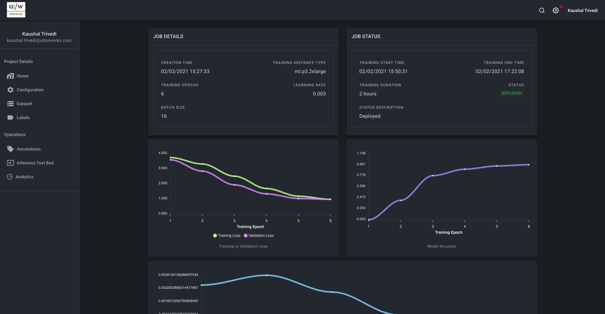

# What is Fast Bert Plus?

Fast Bert Plus is a modern machine learning studio powered by state-of-the-art natural language processing transformer models.
Built on top of our cutting edge open-source library [fast-bert](https://github.com/utterworks/fast-bert), Fast Bert Plus accelarates the process of building, operating, maintaining and improving an NLP model.

### Go from data to deployed endpoint in 3 clicks.  

1. Train (more precisely fine-tune) BERT, RoBERTa and XLNet text classification models on your custom dataset.

2. Tune model hyper-parameters such as epochs, learning rate, batch size, optimiser schedule and more.

3. Save and deploy trained model for inference 

### Industry language model

1. Build a solid foundation for your classification models by building a custom language model

2. Finetune a baseline transformer with custom industry text corpus to improve model performance on downstream (classification) models.

### Labeling workflow powered by machine learning

1. Discover new labels from unlabeled data

2. Accelerate labeling of data by clustering data together using semantic similarity

3. Use natural language generation to generate additional utterances for a label

### Improve model performance using operational predictions

1. Import and review model predictions on production data.

2. Change misclassified items and add them to the dataset.  Fine-tune the model with new data for continuous improvement.

3. Accelerate labeling of existing/new labels based on predicted production data using semantic similarity.

### Collaborative 

1. Add users to the project with role based access control.

2. Separation of responsibilities means business analysts or annotators can focus on data labeling where as project admin can manage model lifecycle.

3. Speed up labeling tasks by spreading load across multiple users.