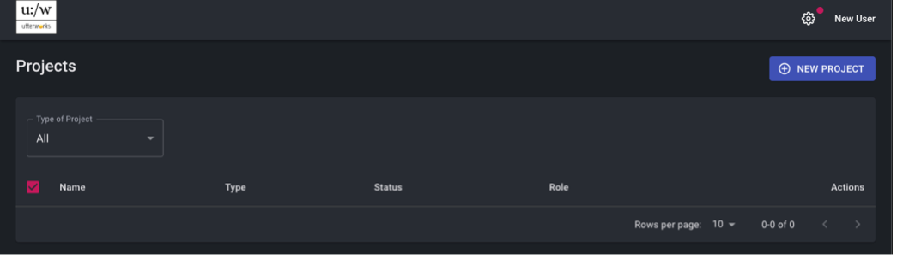
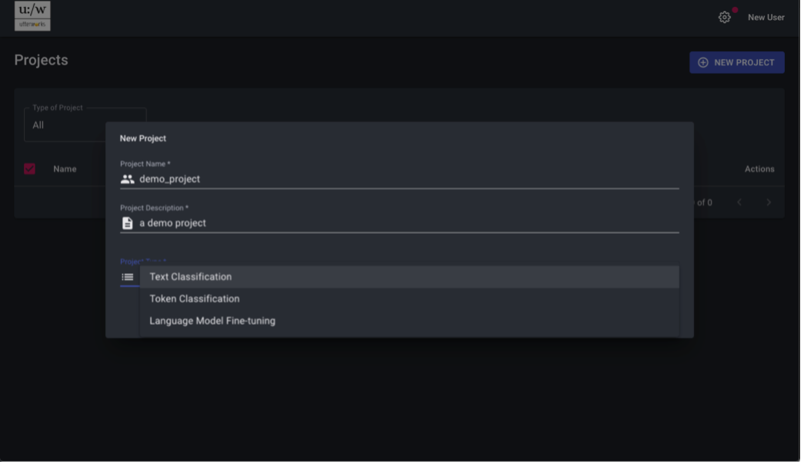
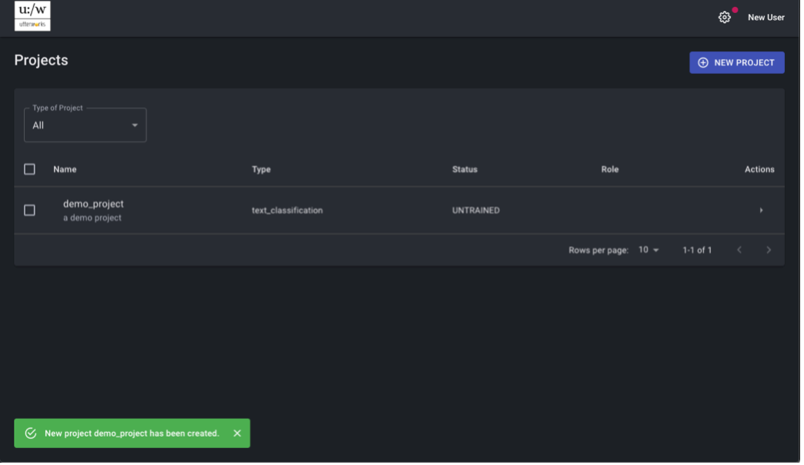

# Create a new Project

The project is the primary entity used for model management. A project is the wrapper for creating, configuring, training, assessing and operating a model.
New projects are created using the <b>New Project</b> button in the projects list / landing page.

The new project needs a name (no spaces), a meaningful description and a project type. Current available types are Text classification, Token classification (coming soon), and Language model fine tuning. This guide will cover a text classification project type. N.B Intent is a text classification model

On successful creation the project will be available in your project list with your role on the project set to 'OWNER - ADMIN'.

