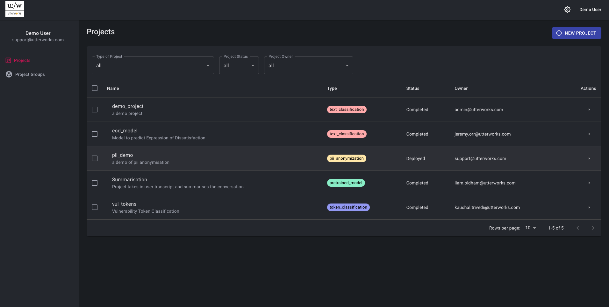
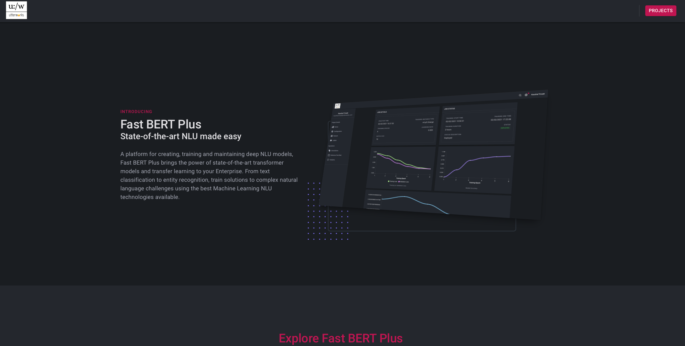
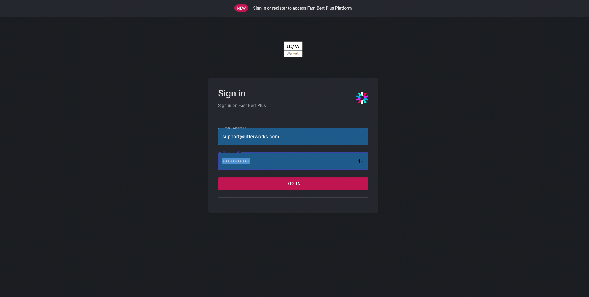

# Project dashboard
The project dashboard is the main landing page of the application. It shows all the projects a user has access to - with the ability to filter this view based on certain criteria. A platform administrator is able to toggle on a view that allows them to see all projects in an environment.

## Signing in
When first accessing FBP (working title), the front page of the application presents the "Projects" link in the top right hand side. 

This will take you to the login prompt where you will use your user name and password to access the application. 
> N.B the platform admin is responsible for creating user accounts - once this has been done a user will receive an onboarding email with their login details and a temporary password. On first login the new user will be prompted to change the temporary password.

## Project Types

### Text classification
Text classification projects are a simple, powerful way of training a model to classify text. The model is trained using a dataset of text and label (classification) pairs and once trained is able to accurately (dependign on the quality of the training data) generalise and classify texts it has never seen before. The training data is a fine tuning layer applied on top of an already deep pre-trained model - selected from a library of model architectures available in the configuration section.
> A classic example of a text classification model is predicting customer intent. Many organisations have upwards of 150 intents that customers contact them with, and the ability to automatically, rapidly and accurately predict the intent from an initial utterance has great value in improving customer service, both in real time and in analysing other unstructured data resources.

### Token classification
Token classification projects are used to manage models that can identify specific elements in text (sometimes called entity recognition). This project type allows the training of natural language based classifiers - where labeled training data is provided. Regular expression based recognisers are also configurable, and a number of default recognisers are available for standard entity types e.g. time, distance etc

### Pii anonymisation
Pii anonymisation projects build on the capabilities of token classification and apply them to the problems of data protection of Payment Card Information (PCI) and Personally Identifiable Information (Pii). Using a Pii anonymisation project a service can be configured to recognise Pii and perform a selected anonymisation action on it (Mask, remove, replace with a constant, or replace with "Fake" data). This project type offers a number of default recognisers including card numbers, email addresses, names, phone numbers - and also the option to add additional trained recognisers for more specific use cases (e.g. account numbers)

### Pretrained
The pre-trained project type allows a user to import a model trained outside the platform and allow it to be managed on the platform. There are some limitations to the type of model that is supported, and some enforcement of certain patterns that the model must conform to. This is also the option that we use to provide custom models to a customer.