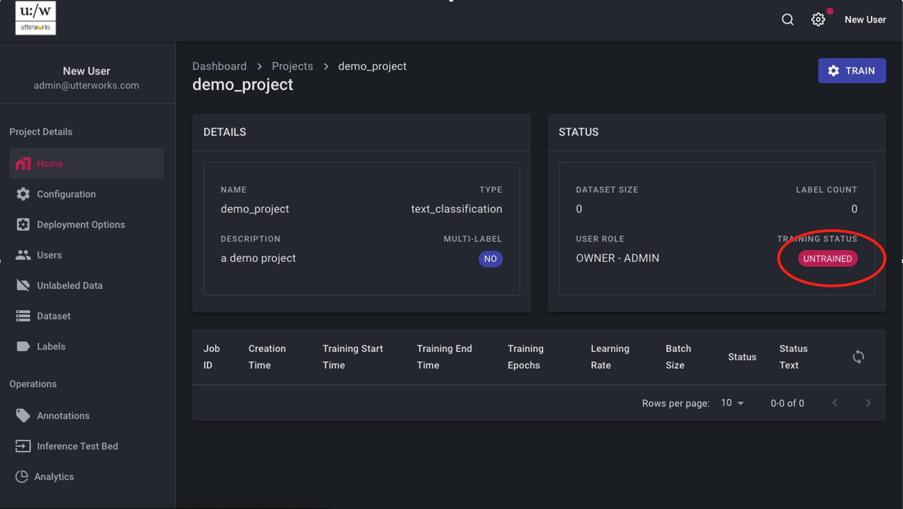
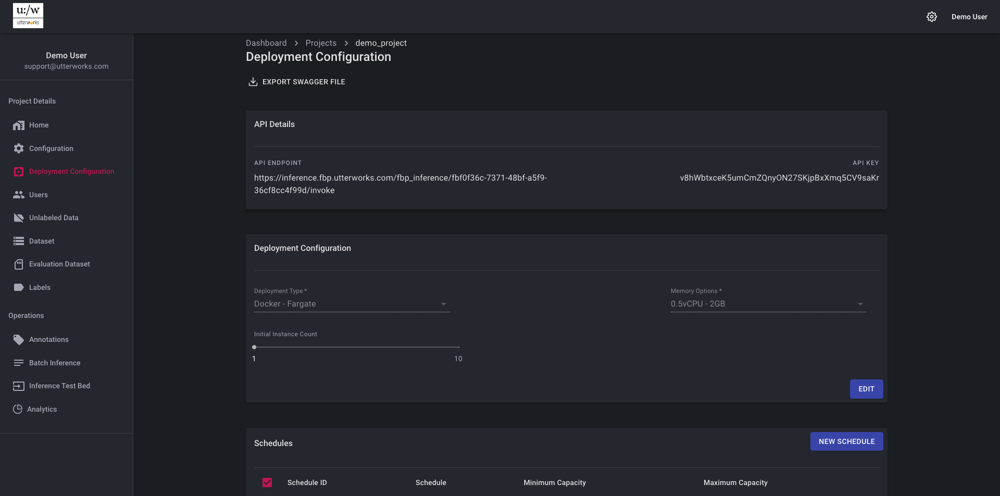
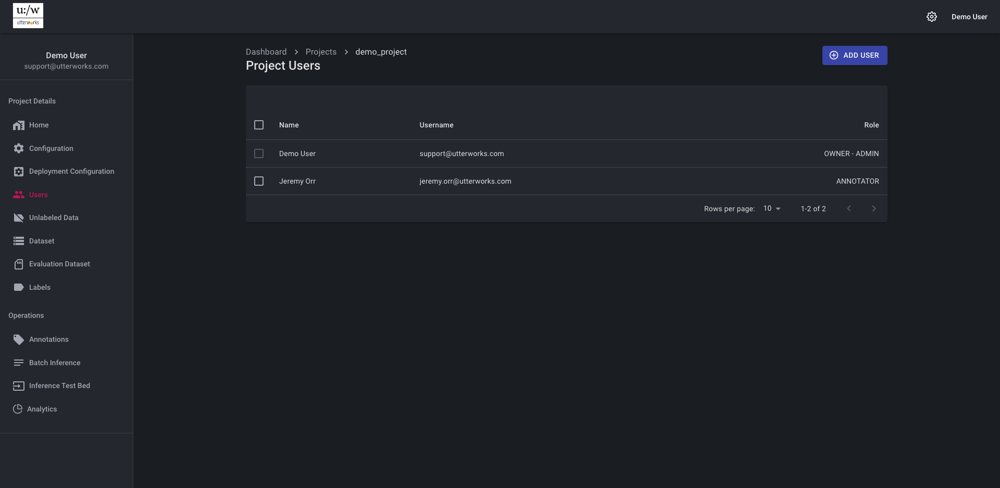
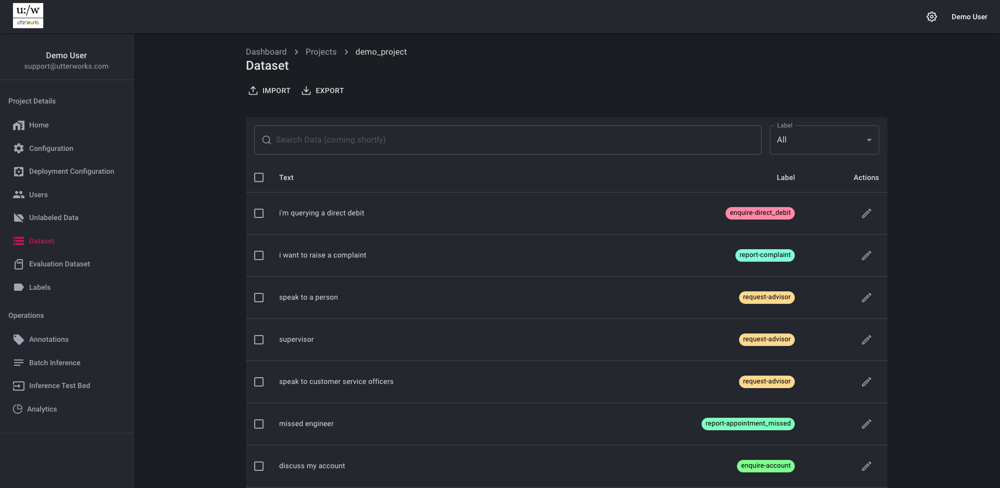
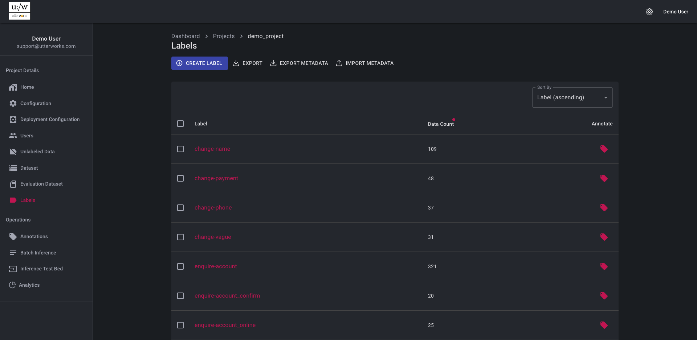

# Project Details

Once the project has been created, click on the project name to configure and administer the project. 

## Home

The Home tab gives a summary of project details and is the place to initiate model training and deployment - once a data set has been created or imported. 
Initially the model is in a state of “UNTRAINED” 

## Configuration

The configuration section holds the hyper-parameters for model training and the parameters for the training runtime environment to be used. These parameters can be changed with the EDIT link.

The configuration options include the ability to select an underlying model architecture (typically a trade-off between size, performance and accuracy), add a pre-trained language model (to improve accuracy in a specific domain) and set other training hyper-parameters. Typically, these parameters can be left at their default values. Once changes are made, select CONFIRM or CANCEL.

<video autoplay muted loop width="740" controls>
  <source src="../video/test.mp4" type="video/mp4"/>
  Your browser does not support the video tag.
</video>

In the configuration it is also possible to select the instance type to be used for the training job
>Larger spec instance types will complete trainig more quickly, but will cost more per training run. It is also possible to choose to use "Spot" instances for training, if these are available then they can greatly reduce training cost - but a word of warning, Spot instance are only available if there is spare capacity - this is unlikely to be the case at time of high demand. If the training job is not time critical it can be launched using Spot and will retry until a Spot instance is available - the job will retry for up to 12 hours 

## Deployment Configuration

The Deployment Configuration section includes the ability to export a Swagger definition of the API that can be used to perform real time inference from the trained model  

### API Details

The Endpoint and API Key provide the configuration details necessary to access the inference API securely

### Deployment Configuration

The trained model needs to be deployed to make it available for real-time inference via the API. This section allows for the deployment type, specification and initial number of instances to be set. [More Info](../user-guide/03-maintain-deployment-configuration.md#deployment-configuration)
> Performance testing of your model is recommended to understand the best specification and number of instances to be deployed to support your workloads

### Schedules
Although the deployed service will auto scale as demand increases, the most effecient operation can be achieved by scheduling scaling events in advance of known demand peaks and troughs. This eliminates any lag in performance from an auto scaling event as additional instances are being started. Where the demand profile is understood, this can be replicated in the scaling schedule to ensure the correct capacity is in place in advance of demand changes. This leaves the auto scaling capability to handle unexpected events and demand peaks. [More Info](../user-guide/03-maintain-deployment-configuration.md#schedules)  

## Users

Add users to the project in this section - additional users can be project administrators with full access, or annotators with access to maintain the dataset, but not to train or deploy the model.

## Unlabeled Data

This section allows a user to import a file of raw text for labellling, the anotator can review this file and select the appropriate label for each text item and push good data to the training dataset

## Dataset

The key input to model training is a labelled dataset. In this section, the data set can be reviewed, edited, exported to csv or imported from a csv file

> Although dataset versions are captured for each training iteration for audit, we recommend exporting the dataset to a source control respository solution for richer configuration management and the implementation of change control

## Evaluation Dataset

It is possible to maintain a static evaluation dataset to help to monitor model performance over time. During trainig the model evaluates its own performance by splitting out a random portion of the training data for dynamic evaluation - the size of this train / test split is controled via Configuration 
> We recommend the use of a static evaluation dataset and a training / test split of 90% training for large text classification models
The static evaluation set is reserved for evaluation (never used for training) as part of each training job and gives the ability to baseline and measure improvements in model accuracy. The outputs of model evaluation (dynamic and staic) are available in the job details view

## Labels

The labels section provides a summary of all the labels used for classificaiton in the model. Labels can be added and edited here (with changes being pushed to the dataset). It is also possible to add meta-data to labels to provide additional grouping or categorisation without needing to create a new model. Metadata can be imported and exported

> We recommend that meta-data is maintained in a source control respository solution for richer configuration management and the implementation of change control