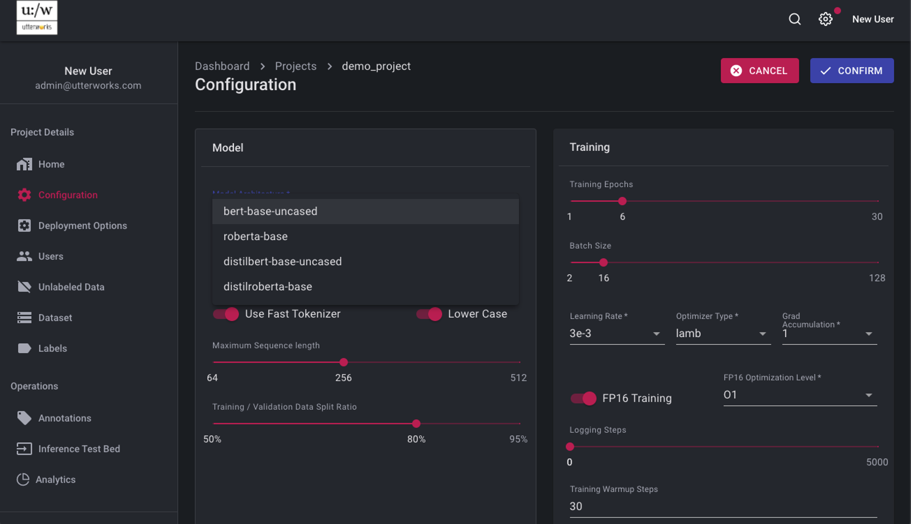

# Project Details

Once the project has been created, click on the project name to configure and administer the project. 

## Home

The Home tab gives a summary of the details and is the place to initiate model training when a data set has been created or imported. 
Initially the model is in a state of “UNTRAINED” 

## Configuration

The configuration section holds the hyper-parameters for model training and parameters for the training runtime environment to be used. These parameters can be changed with the EDIT link.

The configuration options include the ability to select an underlying model architecture (typically a trade-off between size, performance and accuracy), add a pre-trained language model (to improve accuracy in a specific domain) and set other training hyper-parameters. Typically, these parameters can be left at their default values. Once changes are made, select CONFIRM or CANCEL.

In the configuration it is also possible to select the instance type to be used for the training job
>Larger spec instance types will complete trainig more quickly, but will cost more per training run. It is also possible to choose to use "Spot" instances for training, if these are available then they can greatly reduce training cost - but a word of warning, if the trainig job is very long running, there is a risk that the Spot instance gets reclaimed before the job is finished

## Deployment Configuration

The Deployment Configuration section includes the ability to export a Swagger definition of the API that can be used to perform real time inference from the trained model  

<video autoplay muted loop width="740" controls>
  <source src="../video/deploy_config.mov" type="video/mov"/>
  Your browser does not support the video tag.
</video>

### API Details

The Endpoint and API Key provide the configuration details necessary to access the inference API securely

### Deployment Configuration

The trained model needs to be deployed to make it available for real-time inference via the API. This section allows for the deployment type, specification and initial number of instances to be set.
>Performance testing of your model is recommended to understand the best specification and number of instances to be deployed to support your workloads

### Schedules
Although the deployed service will auto scale as demand increases, the most effecient operation can be achieved by scheduling scaling events in advance of known demand peaks and troughs. This eliminates any lag in performance from an auto scaling event as additional instances are being started. Where the demand profile is understood, this can be replicated in the scaling schedule to ensure the correct capacity is in place in advance of demand changes. This leaves the auto scaling capability to handle unexpected events and demand peaks  
