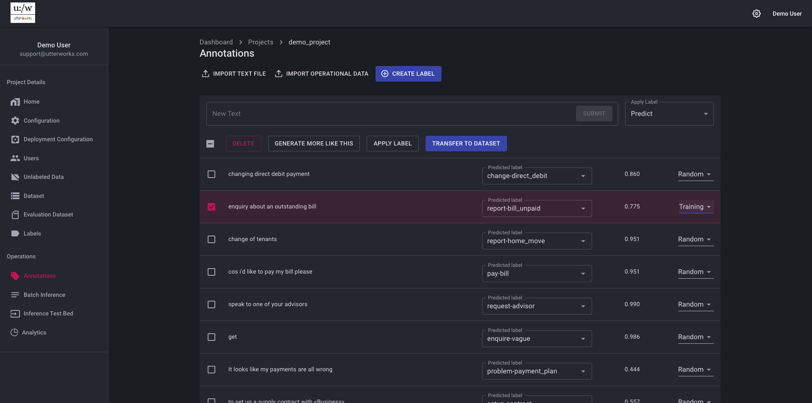
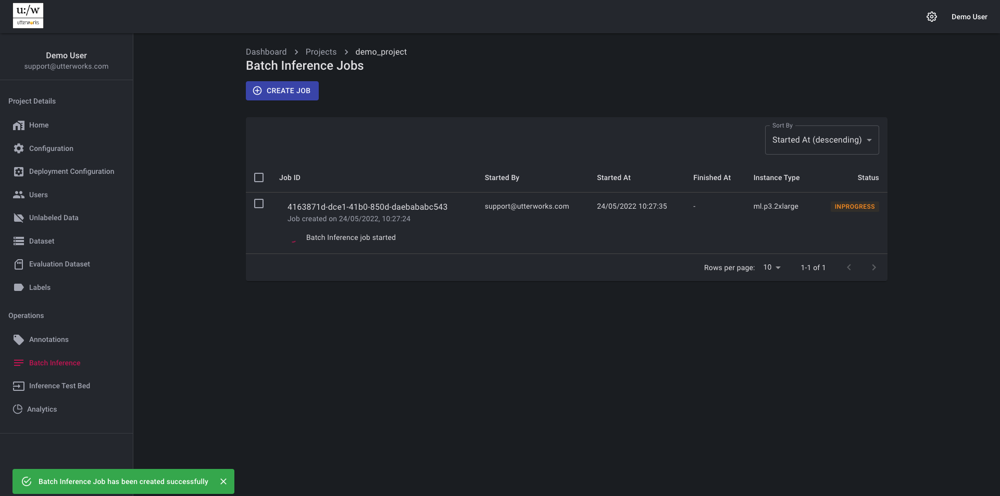
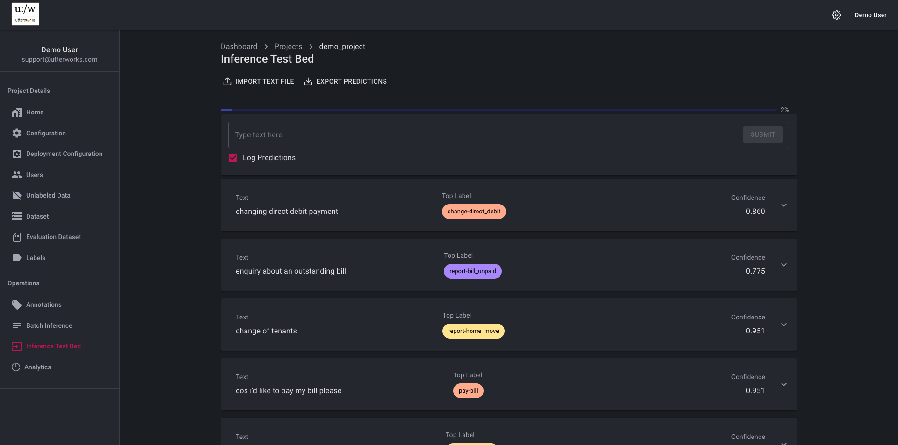
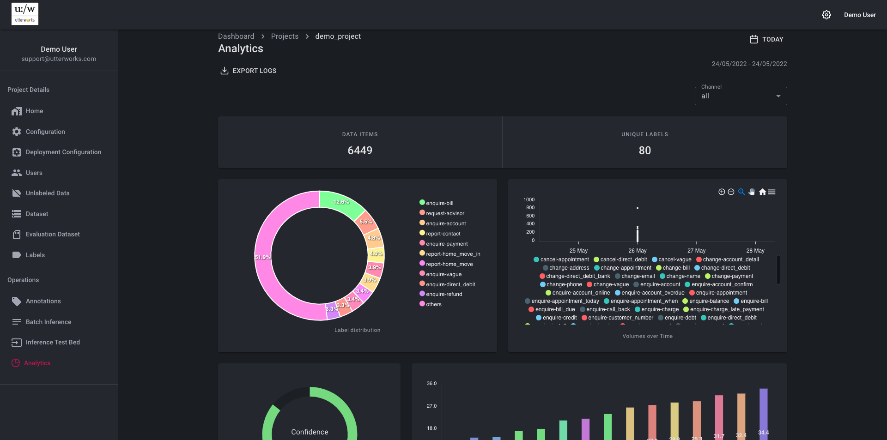

# Project Operations
Once a model or project is in operational use there are a number of options for reviewing, measuring, reporting and enhancing performance available in the Project Operations section 
## Annotations
The annotations section is where additional training data can be reviewed and annotated. Unlabeled potential training data can be imported (and given a predicted label from the current model). Alternatively real operational predictions can be imported for review and can be pushed to the training or evaluation dataset as additional labeled data.

## Batch Inference
The batch inference section allows a large unlabeled dataset to be run through the model in a way that won't impact production operations and in a way that maximises performance. In input file is imported and a model version and instance type can be selected. It is also possible to use Spot instance here.

## Inference Test Bed
The inference test bed allows you to test the model with real-time inference on an input text. Behind the scenes this service uses the deployed API and generates results as any other consumer of the API would see. Predicted labels are ranked by confidence. It is also possible to import a file of texts for inference - this feature is recommended for smaller files (100 items or less), the batch inference service is provided for larger files
     

## Analytics
The analytics section allows the review of metricas from operational predictions. A data range can be specified as can channels (if they are being used). Simple analytics are produced revealing confidence score averages and volumes by label. The analytic data is available to export as a csv for analysis in any preferred analytics tool. The analytic data is also available as a batch pipeline to be ingested into an enterprise warehouse or other data repository.
  