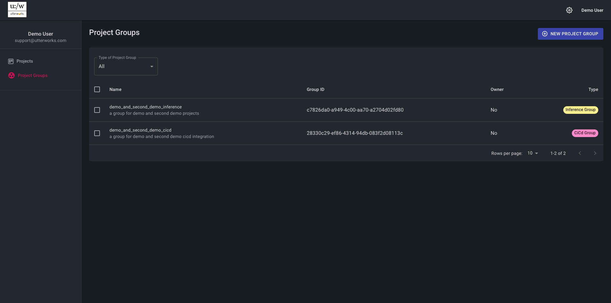

# Project groups
  
## Inference groups
Inference groups are used to group projects together into a single API endpoint that will allow a single text input to be processed by multiple project models in parallel. Use the group id in the url path to invoke the group endpoint. Inference from each project is returned in the response in a section named for the value you give each project as it is added to the group 
## CI/CD groups
CI/CD groups allow for operational predictions from a "production" project to be imported into a non-production project in the same environment. This means that real operational predictions can be imported and reviewed by an annotator to create new labelled data for the dataset. By doing this in a non-production environemnt this data can be added and trained and the model performance reviewed before it is promoted to production